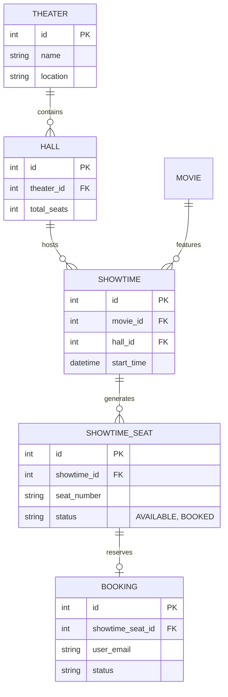

# 🎟️ High-Concurrency Ticket Booking Engine


## 📌 What is this project?

This project is a high-performance, concurrency-safe ticket booking backend engine written in **Go**. By implementing **Pessimistic Row-Level Locking** at the database level and precise connection pool management, this system guarantees zero double-bookings even when facing extreme concurrent load and race conditions.

## ⚡ Core Engineering Features
- **Pessimistic Locking (`SELECT FOR UPDATE`):** Ensures that when a transaction reads a seat's status, that specific row in Postgres is completely locked from other incoming connections until the transaction resolves.
- **Connection Pooling Optimization:** Tuned GORM configuration (`SetMaxOpenConns`, `SetMaxIdleConns`) to prevent PostgreSQL from crashing ("too many clients already") when bombarded with simultaneous requests.
- **Automated Seating Engine:** When a `Showtime` is created, a database transaction automatically sweeps the associated `Hall`'s capacity and instantly generates hundreds of individual physical `ShowtimeSeat` records.
- **Extreme Concurrency Load Tester:** A custom-built Go Goroutine tester that simulates 100 users fighting for a single seat simultaneously to prove the locking mechanism's resilience.

## 🏗️ Architecture & Database Schema



## 🚀 Getting Started

### 1. Clone the Repository
First, clone the repository and navigate into the booking system folder:
```bash
git clone git@github.com:MohdMusaiyab/backend.git
cd backend/booking-system
```

### 2. Start the Application & Database
The entire application (PostgreSQL + Go API Server) is fully Dockerized. Spin everything up with a single command:
```bash
docker-compose up -d --build
```
*(GORM will automatically connect to the Postgres container and auto-migrate all necessary tables on startup!)*

### 3. Seed the Database
Instead of manually typing data, use the built-in control panel to instantly generate Theaters, Halls, Movies, Showtimes, and over 25,000 physical Seats.

> [!WARNING]
> **Only run the seeder once!** Running it multiple times will duplicate Theaters, Movies, and Halls. Once the database is populated, you can safely run the load tester below as many times as you want.

```bash
go run cmd/seeder/main.go
```

---

## 🧪 The Ultimate Race Condition Test
The highlight of this architecture is its absolute resilience to concurrent requests. You can test this yourself using the built-in Extreme Load Tester.

1. Keep the API server running in Terminal 1.
2. Open a second terminal and launch the attack script:
```bash
go run cmd/tester/main.go
```
**What happens?** The script dynamically pulls a random `AVAILABLE` seat from the database. It then spins up **100 parallel Goroutines** and fires them at the `/book` endpoint at the exact same millisecond. 

**The Result:** You will see exactly **1 Success** and **99 Rejections (409 Conflict)**. The PostgreSQL lock handles the queue seamlessly without a single double-booking.

---

## 📡 API Reference

| Method | Endpoint | Description |
|--------|----------|-------------|
| **POST** | `/theaters` | Create a new theater |
| **GET** | `/theaters` | List theaters (Supports `?page=` & `?limit=`) |
| **GET** | `/theaters/:id` | Get specific theater (Preloads all Halls) |
| **POST** | `/halls` | Add a hall to a theater |
| **GET** | `/halls` | List all halls |
| **POST** | `/movies` | Create a movie |
| **GET** | `/movies` | Search movies (Supports `?title=` & `?max_duration=`) |
| **POST** | `/showtimes` | Create a showtime (Auto-generates physical seats) |
| **GET** | `/showtimes/:id/seats` | Fetch all seats for a specific showtime (For UI mapping) |
| **POST** | `/book` | **Core:** Books a specific seat using Pessimistic Locking |
